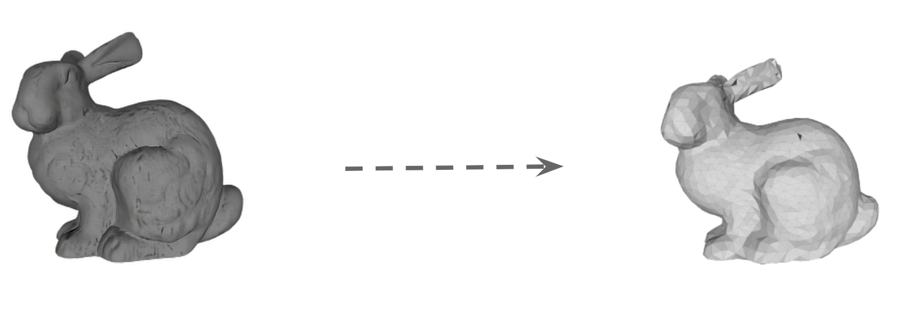
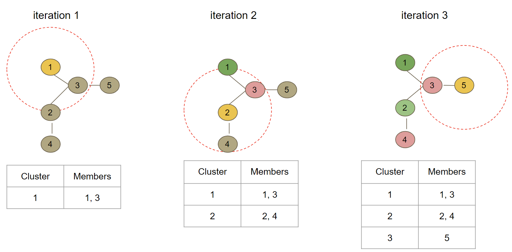

# # Lock-free Vertex Clustering for Multicore Mesh Reduction

  

## About the project
Modern data collection methods can capture representations of 3D objects at resolutions much greater than they can be discretely rendered as an image. To improve the efficiency of storage, transmission, rendering, and editing of 3D models constructed from such data, it is beneficial to first employ a mesh reduction technique to reduce the size of a mesh. Vertex clustering, a technique that merges close vertices together, has particularly wide applicability, because it operates only on vertices and their spatial proximity. Given an order for vertices, a sequential implementation of the algorithm would iterate unclustered vertices and create for each one a new cluster with that vertex and all other unclustered vertices within a user-specified range of epsilon. The example below illustrates this clustering process.

  

However, it is very difficult to parallelise vertex clustering in a deterministic manner because it contains extensive algorithmic dependencies. This project introduces _P-Weld_, a lock-free, multi-core algorithm. It is implemented as an extension to the `MergeCloseVertices(...)` function in [Open3D](www.open3d.org), which we refer to as _S-Weld_. The key idea is to perform a map-reduce style convergence process using a spatial proximity graph as an explicit representation of flow dependencies that can be synchronised with atomic primitives.

For details, refer to [the paper](https://dl.acm.org/doi/10.1145/3610548.3618234).

## Getting started
### Dependencies
- CMake 3.4 or higher
- C++17 or higher
### Building the project
- Clone the repo
`git clone git@github.com:nimaft97/parallel-vertex-clustering.git`
- Navigate to the main directory
- Create a folder to build the project and enter it
`mkdir build && cd build/`
- Generate Makefile using CMake
`cmake -DCMAKE_BUILD_TYPE=Release ..`
- Build using Make
`make`
- Upon successful completion of the building phase, two executables called `epsilon-finder` and `merge-vertices` must be created. epsilon-finder is a complimentary tool to help the user find the right epsilon corresponding to the requested reduction rate, while merge-vertices expects to receive epsilon along with number of cores, path to the dataset and the algorithm type.

## Usage
In the `build` folder, run either of the executables with no extra arguments for help.
`./merge-vertices <eps> <algorithm> <path-to-ply-dataset> <number of cores to launch> <optional-output-path>`

__Note that the only accepted dataset type at the moment is ply__

## Citation

If you use this code in your research, please cite [our paper](https://dl.acm.org/doi/10.1145/3610548.3618234):  

```bibtex
@inproceedings{10.1145/3610548.3618234,
author = {Fathollahi, Nima and Chester, Sean},
title = {Lock-Free Vertex Clustering for Multicore Mesh Reduction},
year = {2023},
url = {https://doi.org/10.1145/3610548.3618234},
doi = {10.1145/3610548.3618234},
booktitle = {{SIGGRAPH} Asia 2023 Conference Papers},
articleno = {60},
numpages = {10}
}
```
